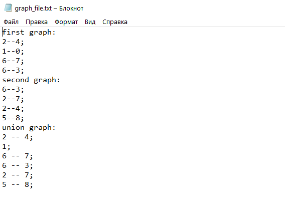

# Задание 28. Найти объединение двух заданных графов

## Домашнее задание 4

### graphU.c


Программа считывает из консоли связанные вершины первого графа в динамические массивы **x_graph_1** и **y_graph_1**, а так же в файл **graph_file.txt**. Для обозначения несвязаннной вершины достаточно после ввода первой вершины ввести любой символ или '0''

```c   
    FILE* graph_file;
    if ((graph_file = fopen("graph_file.txt", "w")) == NULL)
    {
        printf("Cannot open file.\n");
        exit(1);
    }
    fprintf(graph_file, "first graph:\n");
    while (buffer != '>')
    {   
        x_graph_1 = (int*)realloc(x_graph_1, ((n1 + 1) * sizeof(int)));
        y_graph_1 = (int*)realloc(y_graph_1, ((n1 + 1) * sizeof(int)));
        scanf("%d%d", (x_graph_1 + n1), (y_graph_1 + n1 ));
        buffer = getchar();
        if (*(x_graph_1 + n1) == -33686019 || *(x_graph_1 + n1) == -842150451)
        {
            *(x_graph_1 + n1) = 0;
        }
        if (*(y_graph_1 + n1) == -33686019 || *(y_graph_1 + n1) == -842150451)
        {
            *(y_graph_1 + n1) = 0;
        }
        fprintf(graph_file, "%d--%d;\n", *(x_graph_1 + n1), *(y_graph_1 + n1));
        n1++;
    }    

```
Для перехода к записи следующего графа нужно нажать **'>'**.
Он записывается так же, как и первый.


Далее два графа записывются в дот файл без лишней инициализации связанных вершин во избежание ошибок в визуализации.
```c
    FILE* dot_file;
    if ((dot_file = fopen("dot_file.txt", "w")) == NULL)
    {
    	printf("Cannot open file.\n");
    	exit(1);
    }
    fprintf(dot_file, "graph G{\n");
    fprintf(graph_file, "union graph:\n");
    for (i = 0; i < n1; i = i++)
    {
        if (*(x_graph_1 + i) != 0)
        {
            if (*(y_graph_1 + i) != 0)
            {
               fprintf(dot_file, "%d -- %d;\n", *(x_graph_1 + i), *(y_graph_1 + i));
               fprintf(graph_file, "%d -- %d;\n", *(x_graph_1 + i), *(y_graph_1 + i));
            }
            else
            {
                fprintf(dot_file, "%d;\n", *(x_graph_1 + i));
                fprintf(graph_file, "%d;\n", *(x_graph_1 + i));
            }
        }
        for (j = 0; j < n2; j = j++)
        {
            if (((*(x_graph_1 + i) == *(x_graph_2 + j)) && (*(y_graph_1 + i) == *(y_graph_2 + j))) || ((*(x_graph_1 + i) == *(y_graph_2 + j)) && (*(y_graph_1 + i) == *(x_graph_2 + j))))
            {
                *(x_graph_2 + j) = 0;
                *(y_graph_2 + j) = 0;
                if (crossing_flag)
                {
                    if (*(x_graph_1 + i) != 0)
                    {
                        if (*(y_graph_1 + i) != 0)
                        {
                            fprintf(dot_file, "%d -- %d;\n", *(x_graph_1 + i), *(y_graph_1 + j + 1));
                            fprintf(graph_file, "%d -- %d;\n", *(x_graph_1 + i), *(y_graph_1 + j + 1));
                        }
                        else
                        {
                            fprintf(dot_file, "%d;\n", *(x_graph_1 + i));
                            fprintf(graph_file, "%d;\n", *(x_graph_1 + i));
                        }
                    }
                }
                crossing_flag = true;
            }
        }
        crossing_flag = false;
    }
    for (j = 0; j < n2; j++)
    {
        if (*(x_graph_2 + j) != 0)
        {
            if (*(y_graph_2 + j) != 0)
            {
                fprintf(dot_file, "%d -- %d;\n", *(x_graph_2 + j), *(y_graph_2 + j));
                fprintf(graph_file, "%d -- %d;\n", *(x_graph_2 + j), *(y_graph_2 + j));
            }
            else
            {
                fprintf(dot_file, "%d;\n", *(x_graph_2 + j));
                fprintf(graph_file, "%d;\n", *(x_graph_2 + j));
            }
        }
    }
    fprintf(dot_file, "}");
    fclose(dot_file);
```
объединенный граф визуализируется с помощью Graphviz.
```c   
 system("dot C:\\Users\\duhin\\source\\repos\\graphU\\dot_file.txt -Tbmp -o graph.bmp");
    system("rundll32  \"%ProgramFiles%\\Windows Photo Viewer\\PhotoViewer.dll\", ImageView_Fullscreen C:\\Users\\duhin\\source\\repos\\graphU\\graph.bmp");
``` 
Информация о двух вводимых графах и об объединенном графе в **graph_file.txt**.

Пример визуализация объединения двух графов.

